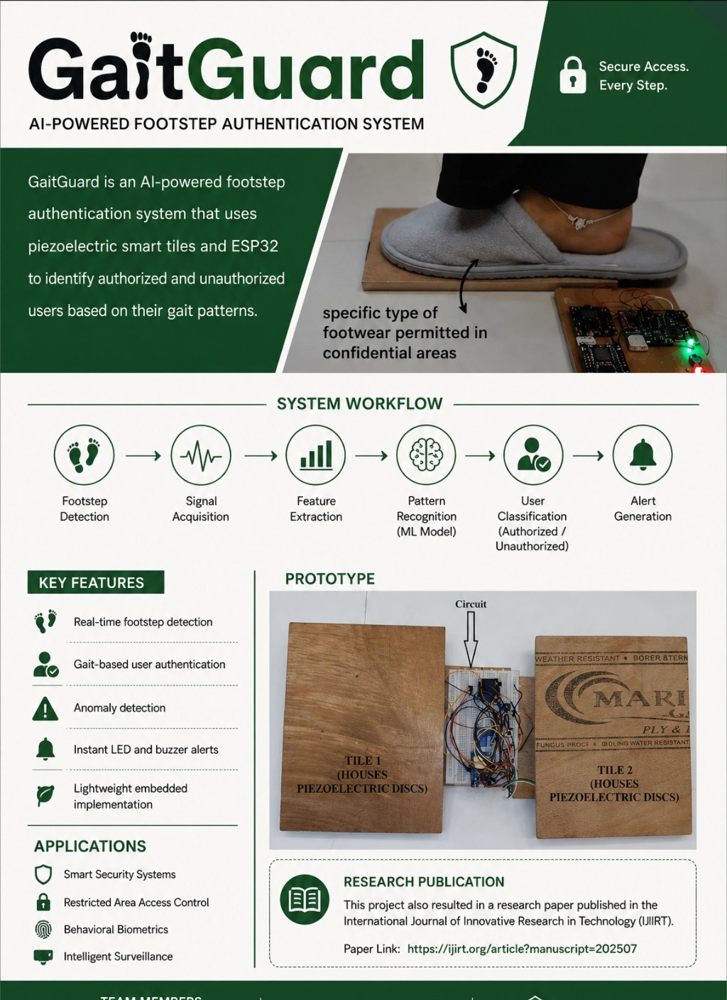

  

# GaitGuard

## Intelligent Gait Recognition & User Authentication System

GaitGuard is an AI-powered footstep authentication system that uses piezoelectric smart tiles to identify authorized and unauthorized users based on their gait patterns.

### Overview

The system captures footstep signals through piezoelectric sensors and processes them using an ESP32 microcontroller and ADS1115 ADC. By analyzing gait features such as step timing, pressure patterns, walking style, and tile activation sequence, GaitGuard performs real-time user authentication and anomaly detection.

### Features

* Real-time footstep detection
* Gait-based user authentication
* Pattern recognition and anomaly detection
* Instant LED and buzzer alerts
* Lightweight embedded implementation

### Hardware Used

* ESP32
* Piezoelectric Sensors
* ADS1115 ADC
* LM358 Signal Conditioning Circuit
* LEDs
* Buzzer

### System Workflow

Footstep Detection → Signal Acquisition → Feature Extraction → Pattern Recognition → User Classification as authorised or unauthorised → Alert Generation

### Applications

* Smart Security Systems
* Restricted Area Access Control
* Behavioral Biometrics
* Intelligent Surveillance
* Smart Buildings

### Research Publication

This project also resulted in a published research paper in the International Journal of Innovative Research in Technology (IJIRT).

Paper Link:
https://ijirt.org/article?manuscript=202507

### Team

Sneha Rawool and Team
AISSMS Institute of Information Technology
